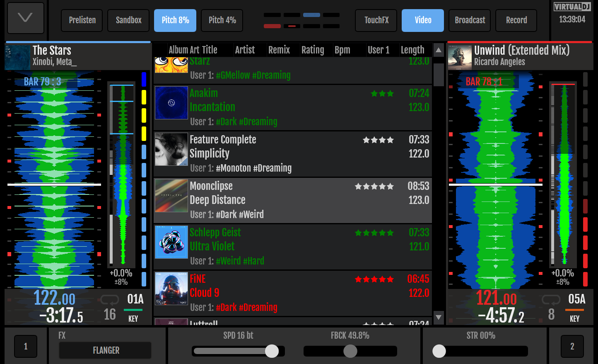

# Probably the Best Virtual DJ Skin for Denon PrimeGO and Prime4 Controllers

This project develops an improved Skin/User-Interface for Virtual DJ for screens of controllers like the *Denon Prime 4* and the *Denon Prime GO*.

The new Skin features beside the standard features:
* The  *Prime GO* gets support to handle **full 4 decks**.
* All devices are able to do **video mixing** without the need to look on the laptop screen anymore.
* All devices get full **vertical wave-line support** for 2 and 4 decks.
* All devices get a day-light scheme, which makes them better usable under bright daylight conditions.
* Use the browser to **edit tags**, to mark songs and to **prelisten to songs** before loading them into a deck.
* Want to listen to the song, that is currently playing to check how to mix it best? The skin **supports VDJs sandbox mode** to listen to any song-position of the master song while the audience keeps listening to the song the *normal* way.

[***Click here to see the full feature list***](docs/features.md)

Here are some images to show you the new views of the skin:

## Why should I use this Skin?
This skin adds a great new value to the controller and makes a huge difference on what you can do with your controller. Especially compared to the standalone Engine DJ software.

## Motivation
VDJ is the most customizable DJ mixing tool that exist. It is incredible feature-rich and implements advanced features like just in time stems separation with awesome quality. It is a full video-mixing tool and supports nearly every controller out there.

But the best feature is that everything can be customized. It supports a [script language](https://www.virtualdj.com/wiki/VDJscript.html) that can be used to do anything you want on a button press or a fader move. And the whole UI is defined with an [XML-syntax](https://www.virtualdj.com/wiki/Skin%20SDK) so that everybody is free to adjust, extend, or completely redesign the UI on the laptop screen , but on the controller screen, as-well.

I've been using the default skins for the Prime 4 for some time now and always thought that some features, VDJ can do, were missing in the screen of the controller.

So I decided to learn the script language and the XML syntax to improve the UI to my needs and to make the devices more usable and feature rich.

## Installation
Be aware that this project is a private project. The delivered code comes with absolute no warranty.

### How to Install
* Goto to the  [latest release page](https://github.com/jochenunger/vdj-denon-prime-skin/releases)
* Download either `Denon Prime4 Screen.zip` or `Denon PrimeGO Screen` depending on your controller
* Find the VDJ home folder. On windows is is `%USERPROFILE%\Documents\VirtualDJ` or `%USERPROFILE%\AppData\Local\VirtualDJ`. Unable to find it? Checkout [this tutorial on YouTube](https://youtu.be/JmMLfJLpFHY).
* Rename filename and remove periods. For example `Denon.PRIMEGO.Screen.zip` to `Denon PRIMEGO Screen.zip` (Releases on GitHub seam to add those periods during upload).
* Put the file in the subfolder `Skins`. Make sure to back up your customized package beforehand if any! Otherwise, just override the existing default file.
* Restart VDJ
* Have fun ;-)

### How to Uninstall
* Just delete the ZIP-file in your `Skin` folder. VDJ will download the default skin as soon as you restart VDJ with a connected controller.

## Getting involved
You found a bug? Report it as an [Issues](https://github.com/jochenunger/vdj-denon-prime-skin/issues).
You want to improve, feel free to fork or to create Pull-Requests.

## Support & Contact

- Want to support my work? [Spend a 🍺](https://www.paypal.com/donate/?hosted_button_id=V3QQXGB5NE8W6)!
- See my stuff in action [on YouTube](https://www.youtube.com/channel/UCI85y8RLyZenoc3k8AA5jyQ).
- Feel free to write me: electronic.greenroom[at]gmail.com
