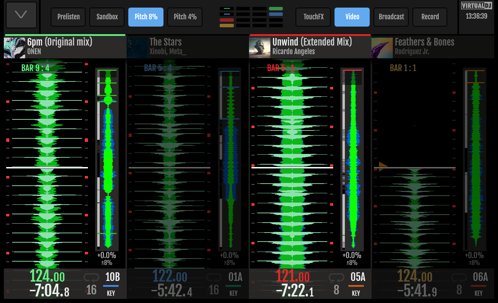
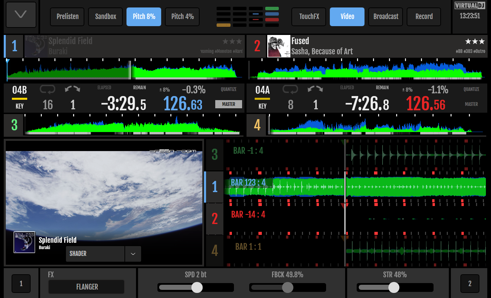
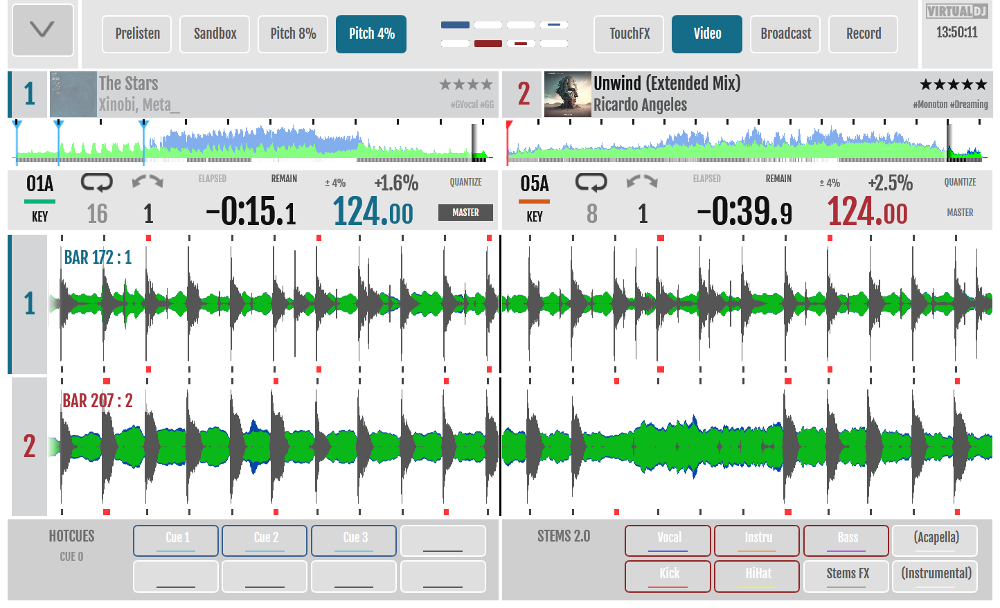

# Features

The skin bases on the Default Skin of the *Denon Prime GO*. That means that the feature set of that skin is available and described [on the VirtualDJ Website](https://www.virtualdj.com/manuals/hardware/denon/primego/index.html).

## All Supported Devices

Want to see the features in action and got everything explained? See this video on YoutTube. 

### 4 Deck Horzontal View

Added 4 deck horizontal view. All 4 wavelines are shown at one sight. The decks are displayed in a reduces Swap view.

Meaning, that the *inactive* deck is displayed very small with the mandatory information only, where the *active* deck displays all the information. Changing the active deck will swap the information.

The deck with volume fader up, has a small line prepended so that you are always sure, which deck is playing currently.[^1]

### 2 Deck Vertical View

Two decks are displayed verticaly. The wave and the song position can be touched using the finger.

The header contains information about the song, like title, remix, and artist. The album art can be displayed as-well.

The lower part shows information about the BPMs, the time, and the key.  

The middle part contains a browser in card-configuartion with the current playlist. Songs can be dragged and dropped onto the decks with the finger.

### 4 Deck Vertical View

The four decks vertical view displays all four decks at a time, so that multichannel mixing is possible without beeing confused. 

Information per deck is displayed as it is in the two decks view. As an option the inactive deck can be "grayed-out" a bit. Meaning that the active decks shine brighter so that it is always clear, what deck is active in the current moment. 

### Video Support

VDJ is able to do full video mixing out of the box. But most Controller Skins do not take any benefit out of this powerfull feature.

Myself, comming from the *Reloop Touch* controller, was suprised that the well implemented video mixing features of the *Reloop Touch* did not make it into following up controllers.[^2]

With this skin video mixing is available on the controller. Activated by an option, you are able to view videos master out and videos per deck at a glance.

Tipp on the vieo to enlarge the master out.

### Daylight Theme

The whole user interface can be displayed in a daylight mode so that most colors are inverted. Like this the controller can be used in bright conditions much more easy.

Just go into the settings and check the options in the `EXTENSION` tap. 

Switch between both modes

### Sandbox Mode

Want to knowhow the currently playing song on master ends to find the best transition? This is possible with VDJ. You can switch to the *Sandbox Mode* and jump to every songpostition of the song being played on master with you headphones. The audience keeps listening to the song just as normal. See this [video of VDJ](https://youtu.be/B7lS1MPA-kI), which explains sandbox mode in detail.

This mode can be actived on your controller screen. It'll fade out everything else so that you don't get confused.

Just press anywhere except the songposition to leave the mode. 

## Prime GO Specific Optimizations
The *Prime Go* compared to the *Prime 4* has some special requirements to address.

### 4 Button Pads
It has only 4 Button Pads with a *Bank*-Button to switch between the banks. This requires a special view representation, too.

### VU Meter per Channel

One of the most anying things on the *Prime GO* is, due to its limited size, that VU-meters are missing per channel. So the correct gain volumn must be figured out during the mix.

So this skin adds a visul VU-meter per each channel to address this problem.

### Visualization of the Effect Section

Singe the *Prime GO* misses screens for the effect, those have to be displayed all the time on the screen, to know which deck has wich effect active.

The default effect section has been customized to enable full 4 channel mixing using the effects.

[^1]: In case of the Prime GO this is a VU Meter.

[^2]: Beeing in contact with the VDJ guys, this is due to technical limitations, that the SDK of Denon has. When it comes to fast moving screen content with a lot of pixel changes over short time, the SDK API is unable to handle it correctly and the display stutters or gets delayed.
  And this is my experience, too. It won't work for full screen video. But with a reduced viewport for videos this can be integrated without any problems.

